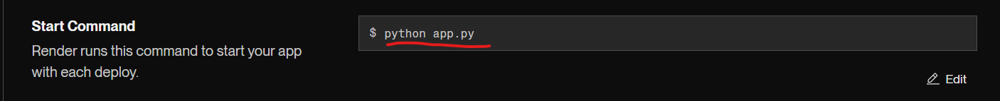
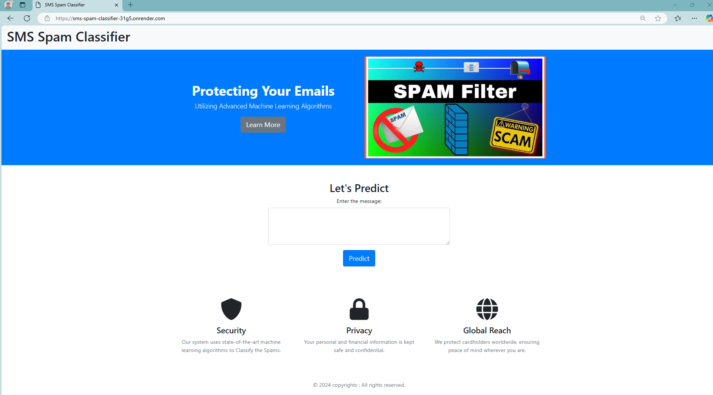
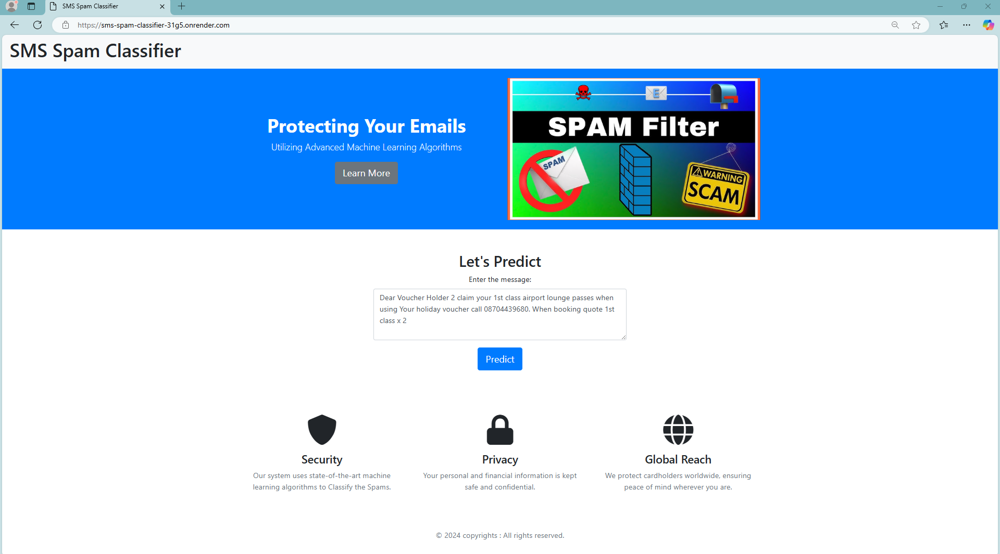
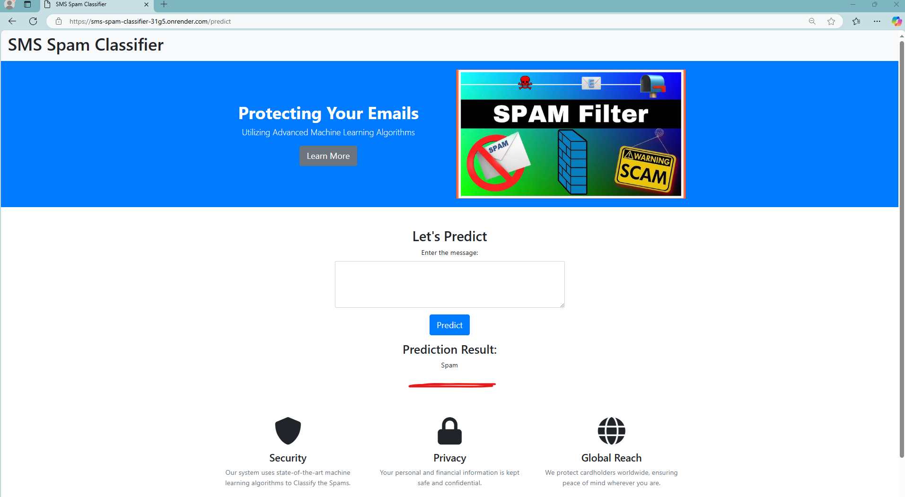

# SmS_Spam_Classifier

Project deployed on Render. Please click the link aside for live demo. [https://sms-spam-classifier-31g5.onrender.com/]

Certainly, here are the step-by-step instructions for setting up and running the application using a virtual environment for Python 3.9:

1. **Setup Virtual Environment**:
   - Open the terminal.
   - Install the virtual environment package if you haven't already: `conda create -p .venv python==3.9 -y`.
   - Create a virtual environment: `virtualenv venv`.
   - Activate the virtual environment: `conda activate .venv/`

2. **Install Requirements**:
   - Install the requirements: `pip install -r requirements.txt`.

3. **Set Up the Jupyter Notebook**:
   - Open the Jupyter Notebook in your virtual environment.
   - `pip install ipykernel`
   - `pip install jupyter notebook`

4. **Run Application.py**:
   - `python app.py`

5. **Let's Deploy it at Render.com**:
   - go to this website: https://dashboard.render.com/web
   - then click on new and choose web serivces
   - choose this :Build and deploy from a Git repository and click on next
   - then in settings : 

6. **So click on manual Deploy and select deploy with latest commit**
   - Wait 2-3 mins after that your website will be published.
   - https://sms-spam-classifier-31g5.onrender.com/ 

   
   

   The output:
   
   

   

 

